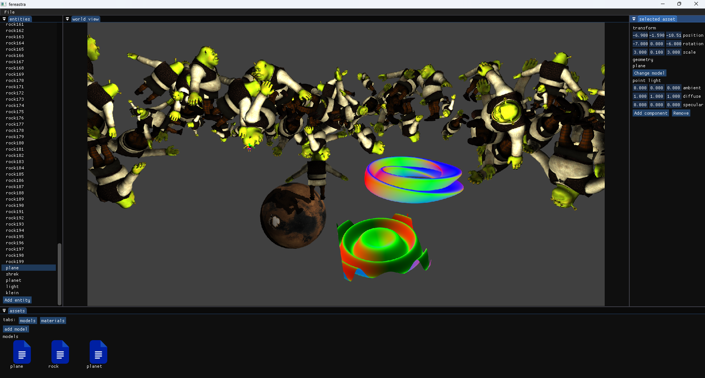

# GLtest

GLtest is a graphics engine that started more as a way to learn about graphics programming, but got bigger than I expected.

## Description

The engine features the ability to create a 3d scene from resources and entities with components. The types of components an entity can own are geometry, instanced geometry, and point light. The type of resources that can be created or imported are materials and models. 

There is also the option to change the shader with which a model is loaded, but they are hard coded.
The available additional shaders are the ones for rendering a sin wave or a klein bottle on a entity that has a light component and a plane attached to its geometry.
A model rendered with the default or instanced shader will have shadows casted onto it.

## Getting Started

### Dependencies

* Linux or Windows.
* Anything that handles cmake files.
* Opengl 4.6 
* Any c++ 20 compiler

### Building and executing

* The application can be built directly with the use of cmake, or within an IDE like Clion or Visual Studio.
* Depending on the OS, cmake may run unsuccessfully at first and mention what missing packages it needs.
* After the build is complete, the engine can be started directly by the IDE, or by running the executable generated inside the editor project. ( ex. editor.exe on Windows )

## Author

Marian Sorin  
sorinmarian1000@gmail.com

## Acknowledgments

* [glfw](https://github.com/glfw/glfw)
* [glm](https://github.com/icaven/glm)
* [assimp](https://github.com/assimp/assimp)
* [imgui](https://github.com/ocornut/imgui)

## Mentions

There is also a half working serialization system, that I didn't finish because I started working on a new engine.

The engine started as a way to experiment with opengl, but I ended up extending it more than I expected. The application is not perfect and may crash from some specific actions, like selecting a wrong file type when importing a model.

There are some 3D models and textures that I downloaded for free from the internet in engine/assets.